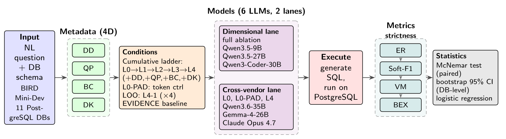

# Metadata Completeness Ablation: BIRD Mini-Dev Reproducibility Repo

Companion artifact to *Does Metadata Completeness Predict Text-to-SQL Accuracy? A Six-Model Ablation on BIRD Mini-Dev*. A standalone, runnable reproduction of the experiment's analysis pipeline: from the BIRD documents and the per-cell model outputs, it regenerates every table and figure in the paper.



*Figure 1: methodology of the metadata-completeness ablation.*

## Quick start (uv)

```bash
uv sync                                   # create .venv + resolve deps (writes uv.lock)
uv run jupyter notebook                   # then run the notebooks in order
```

The notebooks regenerate every table and figure from the committed `results/`. To re-run the inference that produced `results/`, see [Run the ablation](#run-the-ablation-regenerates-results) below.

## What is in this repo

```
pyproject.toml                      dependencies (managed with uv)
config/experiment-parameters.yaml   run config (source of truth)
run_ablation.py                     runs one (model, condition, db) cell
precompute_gold.py                  caches BIRD gold results (for BEX scoring)

notebooks/
  01-reproducibility-pipeline.ipynb BIRD download -> L0-L4 metadata docs -> schema revision
  02-analysis-and-charts.ipynb      results -> CSV regeneration -> tables + figures

scripts/
  run_experiment.py                 config-driven full-run driver (wraps run_ablation.py)
  provider_matrix_smoke.py          fast per-provider / per-param sanity check
  build_results_csv.py              builds all-results.csv from results/
  per_question_stats.py             McNemar / logit / bootstrap stats
  question_taxonomy.py              per-question difficulty / type breakdown
  status_budget_table.py            operational status budget per model
  semantic_error_taxonomy.py        failure-mode taxonomy (value-incorrect cases)
  revise_docs_against_schema.py     schema-case doc revision (used by notebook 01)

bird_loader/                        BIRD metadata-document generators (notebook 01)
results/<model>/                    per-cell JSON model outputs (committed; the raw evidence)
data/                               CSV exports, regenerated by notebook 02 (gitignored)
figures/                            PNG figures (committed): fig00 methodology + fig01-12 from notebook 02
```

`data/` and `figures/` are **derived** - regenerated by notebook 02 from `results/`. `data/` is gitignored; `figures/` is committed as the paper's figure artifacts.

## Notebook convention

Each notebook is kept in two forms:
- the **clean** source (`NN-name.ipynb`, no outputs), and
- the **executed** copy (`NN-name.nbconvert.ipynb`), generated with:

```bash
uv run jupyter nbconvert --execute --to notebook notebooks/02-analysis-and-charts.ipynb
```

Commit both: the clean notebook is the reviewable source; the `.nbconvert.ipynb` is the captured run with outputs.

## How the experiment is structured

Six models are evaluated on the 11-database BIRD mini-dev benchmark across metadata-completeness conditions. A **cell** is one (model, condition, database): a single inference batch and one measured row.

| Model | Provider |
|---|---|
| Qwen3.5-9B | HuggingFace |
| Qwen3.5-27B | HuggingFace |
| Qwen3-Coder-30B-A3B-Instruct | HuggingFace |
| Qwen3.6-35B-A3B | HuggingFace |
| Gemma-4-26B-A4B-IT | Google |
| Claude Opus 4.7 | Anthropic |

**Lane / cell totals (429 cells across two lanes, plus a 33-cell EVIDENCE baseline):**

| Lane | Composition | Cells |
|---|---|---:|
| Dimensional, leave-one-out | Qwen3.5-9B, Qwen3.5-27B, Qwen3-Coder-30B-A3B-Instruct × 5 conditions (L0-PAD, L4-DD, L4-QP, L4-BC, L4-DK) × 11 dbs | 165 |
| Dimensional, scoped cross-vendor | Qwen3.6-35B-A3B, Gemma-4-26B-A4B-IT, Claude Opus 4.7 × 3 conditions (L0, L0-PAD, L4) × 11 dbs | 99 |
| Cumulative, monolithic | Qwen3.5-9B, Qwen3.5-27B, Qwen3-Coder-30B-A3B-Instruct × 5 levels (L0→L4) × 11 dbs | 165 |
| **Total** | | **429** |
| EVIDENCE baseline (BIRD hints) | Qwen3.5-9B, Qwen3.5-27B, Qwen3-Coder-30B-A3B-Instruct × 11 dbs | 33 |

Operationally, the three dimensional models run their leave-one-out and monolithic conditions as a single 10-level invocation each (via [`scripts/run_experiment.py`](scripts/run_experiment.py)); the cell totals are unchanged.

## Model and parameter configuration

All model/provider/routing/parameter settings live in [`config/experiment-parameters.yaml`](config/experiment-parameters.yaml). The full-run driver ([`scripts/run_experiment.py`](scripts/run_experiment.py)) and the provider smoke ([`scripts/provider_matrix_smoke.py`](scripts/provider_matrix_smoke.py)) read it and map each model's settings onto the runner's environment (`run_ablation.py` itself consumes those `GYZASQL_*` env vars, not the YAML directly). Per model it pins: model id, provider, endpoint/route, token budget, temperature / top_p / top_k / presence_penalty, and thinking mode (and whether it is controllable or intentionally off). Notable: gemma-4 thinking is set explicitly via `thinkingConfig.thinkingLevel` (google-genai SDK); Opus runs thinking-off; the Qwen lanes budget thinking via `max_tokens`.

## Run the ablation (regenerates `results/`)

The committed `results/<model>/` already hold every per-cell model output, so this is only needed to **re-generate** them from scratch, and it **costs provider API credits**.

**Prerequisites**

1. `uv sync`.
2. Run `notebooks/01-reproducibility-pipeline.ipynb` to produce the BIRD data (`bird_mini_dev/minidev/MINIDEV/`) and the revised metadata docs (`bird-docs-revised/`).
3. A loaded `bird_minidev` PostgreSQL database (BIRD's official dump).
4. `uv run python precompute_gold.py` to cache the gold result sets used for BEX scoring.
5. A `.env` with the provider API keys (`HUGGINGFACE_API_KEY`, `ANTHROPIC_API_KEY`, `GOOGLE_API_KEY` or `GEMINI_API_KEY`) and `GYZASQL_BIRD_DATABASE_URL` - the SQLAlchemy URL of your local `bird_minidev` Postgres (default `postgresql+psycopg://localhost/bird_minidev`), which the runner uses to execute both the model-generated SQL (for ER) and the gold SQL (for BEX).

**Run**

```bash
set -a; source .env; set +a                            # load API keys + DB URL into the env
uv run python scripts/run_experiment.py --print-plan   # preview the model/lane/cell matrix, run nothing
uv run python scripts/run_experiment.py --dry-run      # set up metadata only, no LLM calls
uv run python scripts/run_experiment.py                # full run (all 6 models), writes results/<model>/
uv run python scripts/run_experiment.py --models 9B 27B  # subset of models
```

The driver reads `config/experiment-parameters.yaml` (the source of truth) and issues one `run_ablation.py` invocation per model. Runs are resumable: `--skip-if-exists` skips cells whose JSON already exists. `scripts/provider_matrix_smoke.py` is a fast per-provider check to run before a full pass.

## Metrics

- **ER** (Execution Rate): the generated SQL runs without error.
- **Soft-F1 / VM**: partial-overlap and value-match against the gold result set.
- **BEX** (BIRD Execution Accuracy): strict set-equality against the gold result set (what the BIRD leaderboard reports as "EX").

The **ER−BEX gap** is the diagnostic: a query can run yet not answer the question. Full results are in the paper.

## License and citation

Released under the MIT License. If you use this artifact in academic work, please cite the accompanying paper.
